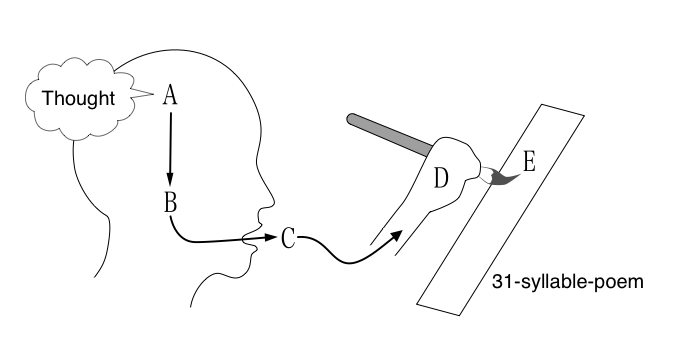

### Plotting Poetry 2025

# <span class="red">Transforming Poetic Thought into Waka:</span>

### How to Pack the Skeleton into a 31-Syllable Closet

- Bor Hodošček, <span class="blue">The University of Osaka</span>
- Hilofumi Yamamoto, <span class="blue">Institute of Science Tokyo</span>



---

## Project Goals

- Reverse-engineer modern interpretations into waka
- Identify compression patterns for poetic thought
- Explore constraints and expression in 31-mora form

---

## Poetic Rules may include:

- Omission of grammatical elements
- Inversion of word order
- Symbolic substitutionk
- Nominalization
- Manipulation of ambiguity
- Compression of meaning
- Expansion of meaning
- Reinterpretation of context
  ...

<!-- JPN_ONLY_START

\ifJPN
本研究の目的は、現代日本語訳を和歌の厳格な31音の形式に圧縮するために使用される詩的戦略を特定し、分類することである。
詩的思考が31音の厳格な構造に変形される過程を分析することで、そのような変換を可能にする根本的なルール（明示的および暗黙的）を明らかにしようとする。
これらのルールには、文法要素の省略、語順の逆転、象徴的な置換、名詞化、曖昧さの操作などが含まれる可能性がある。
\else
This study aims to identify and classify the poetic strategies used to compress expansive modern Japanese translations into the condensed form of waka poetry.
By analyzing how poetic thought is transfigured into the rigid structure of a 31-syllable tanka, we seek to uncover the underlying rules—both overt and covert—that make such transformation possible.
These rules may include omission of grammatical elements, inversion of word order, symbolic substitution, nominalization, and manipulation of ambiguity.
\fi

JPN_ONLY_END -->

---

## Methodology

### Materials

- Kokinshu: a collection of 1000 waka poems
- Modern Japanese translations
- Parallel corpus of waka and modern Japanese translations
- Contemporary paraphrases

---

## Computer programms

- Align waka with contemporary paraphrases
- Use phrase gloss and structured data
- Analyze rule types and transformation limits

---

## Challenges

- Literal vs. interpretive gaps
- Compression loss in reverse mapping
- Ambiguity in source expressions

---

## Waka as Ecosystem

- Waka is not an isolated product of individual expression.
- It emerges from relational interplay:  
  nature, emotion, tradition, audience, and poetic form.
- This is why **an ecosystem model** best describes waka structure.

> “A poem of just 31 syllables cannot exist in isolation—it must depend on interrelation.”

---

## Ecosystem Equation for Waka

```math
W = f(R, N, H, C, V)
```

- **R**: Relationship (e.g. reply, dialogue, past love)
- **N**: Nature (e.g. moon, spring, wind)
- **H**: Heritage (e.g. classical allusions, uta-makura)
- **C**: Context (narrative or emotional setting)
- **V**: Verbal form (e.g. inversion, omission, poetic structure)

---

## Diagram of Interrelation

```
        [R: Relationship] ⇄ [H: Heritage]
              ↑                 ↓
[N: Nature] ⇄ [V: Verbal Form] ⇄ [C: Context]
```

- No element stands alone—each depends on and enriches the others.
- Meaning arises not from the parts, but from their **interdependence**.

---

## Case Study: Ise Monogatari, Section 4

> 月やあらぬ／春や昔の／春ならぬ／わが身は一つ／もとの身にして

- Everything changes (moon, spring)
- Only “I” remain the same—yet this self is defined in relation to what is lost.
- An **ecosystem of absence and memory**.

```
W_Ise4 = f(R_lost love, N_moon/spring, H_classical imagery, C_silent reunion, V_elliptical form)
```

---

## Implication

- Waka poetry is not just **compression**—it is **relational construction**.
- Ecosystem thinking allows us to describe poetic generation **not as encoding**, but as **emergence**.

```
From Monolith (single voice) → To Ecosystem (relational resonance)
```

## Toward a Model

- Create typology of transformation rules
- Visualize linguistic constraints
- Evaluate poetic fidelity and transformation cost

---

## Methods

- Using a parallel corpus of waka and modern Japanese translations
- Align waka with contemporary paraphrases
- Use phrase gloss and structured data
- Analyze rule types and transformation limits
- Identify compression patterns for poetic thought

---

## Results

- Identify and classify poetic strategies
- Analyze how poetic thought is transfigured
- Uncover underlying rules (overt and covert)
- Explore the implications of compression
- Simulate the transformation process:

---

## Discussion

- Explore poetic compression in modern Japanese
- Analyze constraints in poetic expression
- Discuss implications for translation and interpretation
- Consider cultural and linguistic factors

---

## Conclusion

- Waka as a lens for poetic thought
- Compression as a creative constraint
- Future research directions
- Implications for translation studies

---

### Conclusion

- Content of the work is impressive
- Author's skill is impressive as well

<!-- JPN_ONLY_START
作品を通して、和歌は詩的思考のレンズとして機能し、圧縮は創造的な制約として機能することを示す。
作品の内容のすごさを感じるだけでなく、作者のすごさも感じることができる。
JPN_ONLY_END -->
